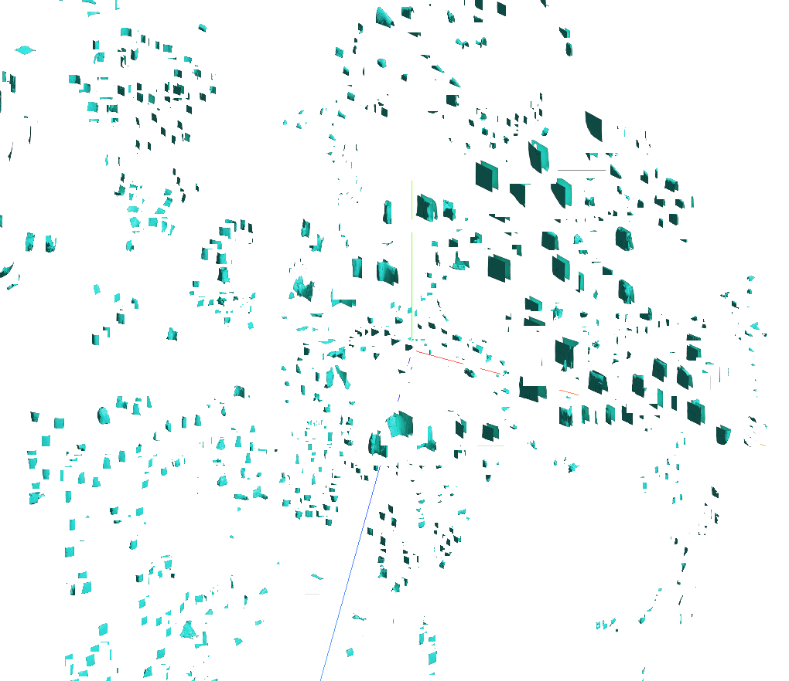

# NVE - Neural Volumetric Envelopes

CSCI 2951 I Final Project, Autumn 2022.

Team: Aditya Ganeshan, Anh Truong, Marc Mapeke, Michael Okunev

Given a sdf or radiance field, convert it into a set of non-overlapping volumetric envelopes. The volumetric envelopes consist of features (at their vertices), which along with a pretrained MLP approximate the field within the envelope.

Checkout more information in our [report](./assets/Neural_Volumetric_Envelopes.pdf) or the google slides [here](https://docs.google.com/presentation/d/14KijD75dUfnpYYU3dibY9ZIVjSnQ9csx8AttxVBXkj4/edit?usp=sharing).

## Outcomes

We learn a codebook + neural networks to compress a dataset of planes. Codebook+NN can highly compress mesh data, with MSE = 0.000511 and Compression factor = 1153.269.

Example of reconstructed shapes.

Examples of learnt envolopes.

## Analysis

Code book showing similarity between different learnt envelopes.

The code book is used well (i.e. none of the entires are unused).

We conduct many ablations on various design decisions.

## Related work

Many works have explore similar directions. Our goal was to first get a baseline working, and then create an "adaptive" version of the envolopes where they are created and split based on the complexity of a given region. Here are some works which are relevant to this direction:

1) Implicit functions in feature space for 3d shape reconstruction and completion, Julian Chibane, Thiemo Alldieck, Gerard Pons-Moll, CVPR 2020

2) Local Implicit Grid Representations for 3D Scenes, Chiyu Max Jiang, Avneesh Sud, Ameesh Makadia, Jingwei Huang, Matthias Nießner, Thomas Funkhouser, CVPR 2020

3) Deep Local Shapes: Learning Local SDF Priors for Detailed 3D Reconstruction, Rohan Chabra, Jan Eric Lenssen, Eddy Ilg, Tanner Schmidt, Julian Straub, Steven Lovegrove, Richard Newcombe, ECCV 2020

4) Learning Deformable Tetrahedral Meshes for 3D Reconstruction, Jun Gao, Wenzheng Chen, Tommy Xiang, Clement Fuji Tsang, Alec Jacobson, Morgan McGuire, Sanja Fidler, NeurIPS 2020.

5) Variable Bitrate Neural Fields, Towaki Takikawa, Alex Evans, Jonathan Tremblay, Thomas Müller, Morgan McGuire, Alec Jacobson, Sanja Fidler, SIGGRAPH 2022.

## Future work

1) Adaptive envelopes: We want to create a set of envelopes which are adaptive to the complexity of the scene. This would allow us to create a more compact representation of the scene.
2) Differentiable envolope membership: We want to make the envolope membership differentiable, so that we can train the envolopes along with the codebook.

## Research questions

1) Can we convert the sdf for a single mesh into a fixed lattice grid envelope?
2) How robust are the features to noise in the lattice structure?
3) Can we learn this over a set of meshes?
4) Can we store this in a single code-book?
5) TBD: Can we use tetrahedral envelopes instead?
6) TBD: Is it better to apply this across class, or across a scene? TBD
7) TBD: Can we generalize for different types of envelopes?

## Baseline approach

### Data processing

1. Given a mesh, fetch (x ,y, z) points with their corresponding sdf values. Also store points on the surface of the mesh.
2. Create a uniform, single resolution lattice structure around the mesh.
3. Save all cube-id with its corresponding points from step 0 : (a) Surface points, (b) sdf points for training.
   1. Optional - Store all points in canonical frame ((x, y, z) - center(corresponding_cube)). Since no scaling is involved with fixed resolution lattice, sdf points can remain as they are.

### Learning

1. We build two networks:
   1. obj-to-feature network: Takes the points in (a) as input, and predicts 8 features of size x.
   2. feature-to-sdf network: Takes the 8 features as input, and using (b) train to predict sdf(x, y, z), given points (x, y, z) as input.
2. End-to-end training!!
   1. Record validation error.

### Visualization & Logging

1. Get the mesh given the two networks, and the envelopes.
2. Logging with W&B.

### Notes

* We want end-to-end training.
* We want to avoid hardcoding the lattice structure information as plan to change that.

## Acknowledgements

Thanks to James Tompkin for conducting this wonderful course.

## Contributions

All team members equally contributed for the report writing and project presentations.

**Aditya Ganeshan:** Code Architecture, training, evaluation \& compression calculation scripts. Blender rendering scripts for shapes/envelopes. Analysis of codebook and envelopes.

**Anh Truong:** Mesh data cleaning. Training point/SDF data generation. Surface point normal estimations. Data processing for per-evenelope data. Feature dimension ablation.

**Marc Mapeke:** Envelope to Feature Network, Marching Cubes Visualization, Grid Size Ablation, Dataloader, Debugging.

**Michael Okunev:** Feature to point network. Logging. Codebook size ablation.
